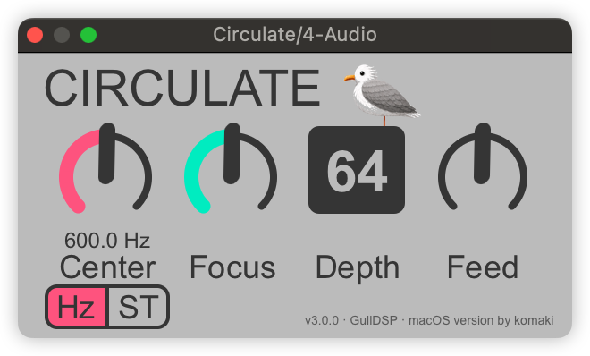

# Circulate Pro

[English](README.md) | [中文](README.zh-CN.md)

> **Circulate Pro 3.1.0：** 本项目是 [GullDSP/Circulate-VST](https://github.com/GullDSP/Circulate-VST) 的跨平台 fork，源代码基于上游 commit `65236c9`（原仓库中的 `v2.0.1.1`）。本 fork 同时提供 Intel/Apple Silicon Universal 2 的 macOS VST3/AUv2、Windows x64 VST3 EXE 安装包、旋钮双击回正、默认值修复和九张独立关键帧图；原有 DSP 算法保持不变。

Circulate Pro 是一款基于全通滤波器的相位扩散效果器。全通滤波器不改变频谱幅度，但会在选定中心频率附近产生选择性的相位偏移，从而形成空洞、金属感和短混响般的听感。该效果在贝斯 Stab、鼓击和 Pluck 等瞬态素材上最明显。

宿主可见的 VST3/AUv2 名称统一为 **Circulate Pro**。为保证旧工程继续识别同一个插件，技术 bundle 文件名、UID 和安装收据标识保持稳定。



## 下载

### Circulate Pro 3.1.0（macOS + Windows）

[统一 Release 发布页](https://github.com/komakizhu/Circulate-Pro/releases)：包含 macOS Universal 2 的 DMG 和 Windows x64 的 EXE 安装包。DMG 内含可选择的 macOS 安装包。

### Windows 原版 ZIP

[下载 circulate-vst3-v2_0_1.zip](https://github.com/GullDSP/Circulate-VST/releases/download/v2.0.1.1/circulate-vst3-v2_0_1.zip)（上游 `v2.0.1.1`）。这是真正的 Windows 原版构建，来源于上游项目。


当前 macOS DMG 包含 Universal 2 VST3、AUv2、可选择的安装包、卸载程序和版权材料。Release 不再提供独立 PKG。未配置 Developer ID 与公证的版本可能触发 macOS Gatekeeper 提示，详见 DMG 中的 README。

## 功能

- 参数与自动化支持采样精度，适合快速、复杂的 DAW 自动化和调制器控制，例如 Ableton LFO。
- 最多 64 级全通滤波器，支持可变 Q 值（共振）。
- 中心频率可直接用 Hz 控制，也可通过 MIDI 音符选择。
- 支持滤波器组正反馈或负反馈，用于产生类似陡峭移相器的频谱效果。

## 参数

- **Center**：全通滤波器中心频率，单位 Hz；点击数值可手动输入精确值。
- **Pitch**：通过 MIDI 音符设置中心频率。
- **Det**：在所选 MIDI 音符的基础上平滑偏移中心频率，范围为 ±1 个八度。
- **Focus**：全通滤波器的 Q 值，即“共振”。低 Q 会使相位扩散覆盖更宽频段，高 Q 会使其集中在中心频率附近。
- **Depth**：滤波器组中的全通滤波器数量，最多 64 级。
- **Feed**：向滤波器组引入反馈，会通过频率抵消或增强改变频谱。

## Version 2

- 支持调整界面大小（右键菜单 → UI Zoom）。
- 降低 CPU 使用率。
- 修复 Ableton 中 Hz 与半音控制切换时的界面问题。
- 修复部分 DAW 中导出音频时的异常行为。
- 支持手动输入 Hz 频率。

## Circulate Pro 3.1.0 修改内容

- 双击任意旋钮可恢复出厂默认值，同时保留 Control/Ctrl-click 回正。
- 拖动任意旋钮时按住 **Shift** 可进行约 10 倍阻尼的细微调整；拖动过程中也可以随时按下或释放 Shift。
- 修正 Note 回正到中点 E4、Depth 回正到 32。
- Depth 0–64 使用九张独立关键帧图按 8 个 Depth 一档跳切：0–7 显示第 1 张，8–15 显示第 2 张，依次到 56–63 显示第 8 张，64 显示第 9 张。九张图直接来自确认的 3×3 原图，不进行路径重绘、路径补间、整图覆盖、透明度渐变或运行时动画。
- 九图严格按阅读顺序作为完整 Depth 状态：0、8、16、24、32、40、48、56、64。生成器只移除网格/背景并对整张图做统一画布定位，不重绘、不混合、不合成新的羽毛细节；原图自带的腿仍位于 Depth 数字框之后。
- 界面恢复原来的大号 **CIRCULATE** 标题，并在右侧加入小型金色挖空 **PRO** 徽标。
- 保留 GullDSP 原作者署名，并加入可跳转至 fork 仓库的克制署名“macOS version by komaki”。

## 构建 macOS 插件

项目通过 Git 子模块包含 Steinberg VST 3 SDK 和 Apple AudioUnitSDK，可构建同时支持 Intel 与 Apple Silicon 的 Universal 2 VST3 和 AUv2 bundle。

```bash
git clone --recurse-submodules https://github.com/komakizhu/Circulate-VST-macOS.git
cd Circulate-VST-macOS
cmake -S . -B build-macos -G "Unix Makefiles" \
  -DCMAKE_BUILD_TYPE=Release \
  -DCMAKE_OSX_ARCHITECTURES="arm64;x86_64" \
  -DSMTG_ENABLE_VSTGUI_SUPPORT=ON \
  -DSMTG_CREATE_PLUGIN_LINK=OFF
cmake --build build-macos -j1
```

VST3 bundle 输出在 `build-macos/VST3/Release/Circulate.vst3`。构建 AUv2 时使用 Xcode generator，并启用 `CIRCULATE_ENABLE_AUV2`：

```bash
cmake -S . -B build-macos-au -G Xcode \
  -DCMAKE_BUILD_TYPE=Release \
  -DCMAKE_OSX_ARCHITECTURES="arm64;x86_64" \
  -DSMTG_ENABLE_VSTGUI_SUPPORT=ON \
  -DSMTG_CREATE_PLUGIN_LINK=OFF \
  -DCIRCULATE_ENABLE_AUV2=ON \
  -DCIRCULATE_AUV2_STAGING_DIR="$PWD/outputs"
cmake --build build-macos-au --config Release
```

当两个 bundle 都位于 `outputs/` 后，运行 `packaging/build-release.sh` 可生成包含可选择安装包的 Universal 2 DMG；不生成独立 PKG Release 资产。

## 自动发布 Circulate Pro Release

对 fork 使用 SSH 推送类似 `v3.1.0-pro` 的标签。仓库中的单一 GitHub Actions workflow 会并行构建包含可选择安装包的 macOS Universal 2 DMG 与 Windows x64 VST3 EXE，然后自动创建或更新同一个 Circulate Pro Release。上传使用仓库级 Actions `GITHUB_TOKEN` 和 `contents: write` 权限，不需要个人 Token，也不需要每次进行浏览器设备登录。

## 许可与致谢

本项目遵循 GPL-3.0。重新发布修改后的二进制时，请同时提供许可证、上游来源和本 fork 的修改说明。

项目使用 [Steinberg VST 3 SDK](https://www.steinberg.net/developers/)。VST 是 Steinberg Media Technologies GmbH 的商标。

上游项目：[GullDSP/Circulate-VST](https://github.com/GullDSP/Circulate-VST)
